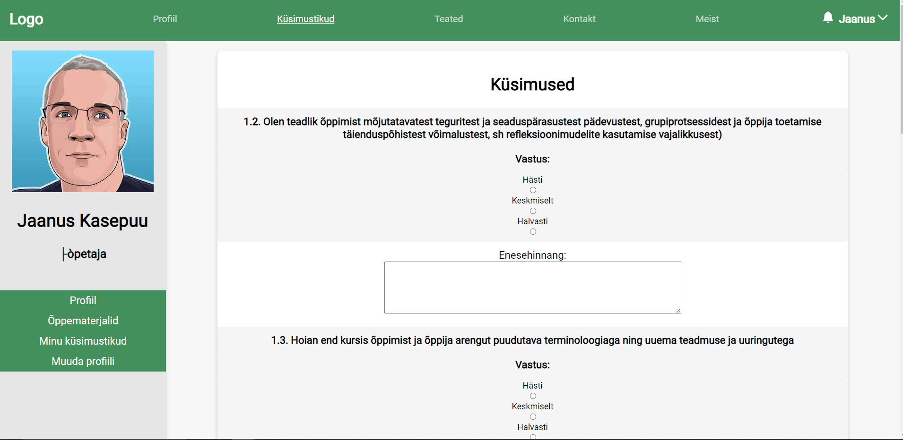
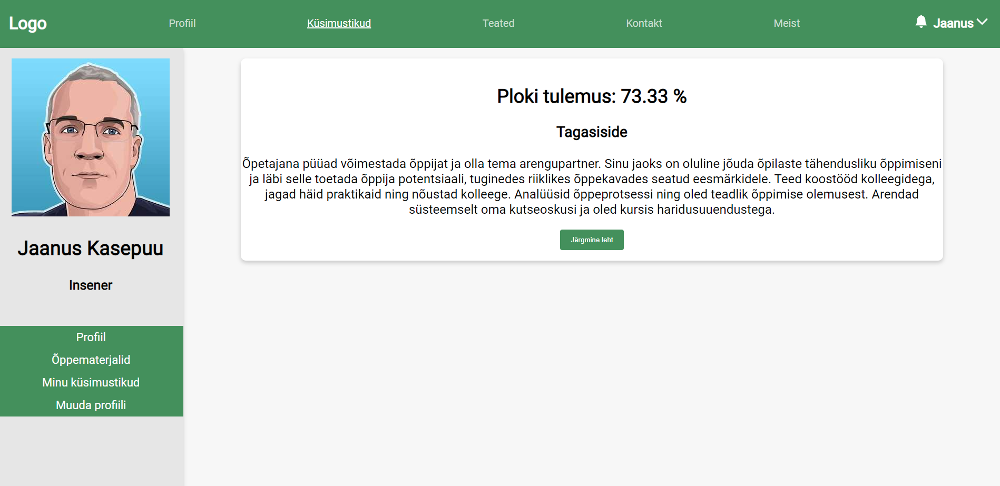
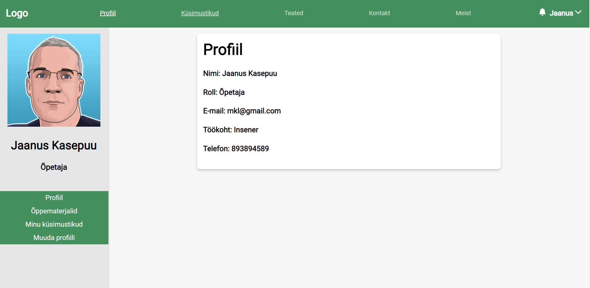
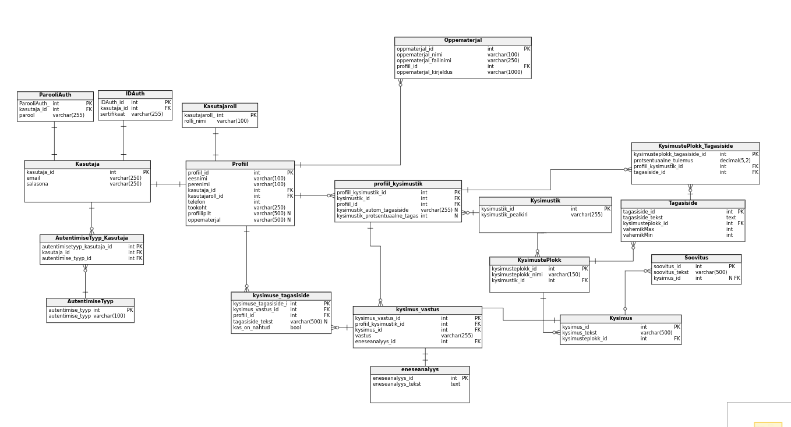

# Õpetaja professionaalse arengu mudel (TLÜ Suvepraktika projekt)

## Pildid rakendusest

## Mis on meie rakenduse eesmärk?
* Lihtsustada õpetajate enesearendus protsessi
* Anda koolidele lihtsam viis õpetajaid hinnata
* Luua õpetajatele lihtne viis kandideerida koolidesse

## Projektist endast
Projekt on loodud TLÜ Digitehnoloogia Instituudi õpilaste poolt ning loodi Tarkvaraarenduse projekti kursuse raames.
Projekti kavandamisega alustati 2021 kevadsemester ning koodi hakati kirjutama juunis 2021. 

## Kasutatud tehnoloogiad
* React (ver 17.0.2)
    * teised kasutatud pluginad client/package.json failis
* Node.js
    * Pluginad server/package.json failis
* Express (ver 4.17.1)
* MariaDB (ver 10.5.10)
* Python (ver 3.9.5)
* Selenium (ver 3.141.0)

## Loojad
* **Alex Nelke**
* **Caroly Vilo**
* **Martin Kilgi**
* **Mait Jurask**

## Edasiarendajad
* **Adrian Käsper**
* **Sander Sims**
* **Andre Piiriste**
* **Reigo Kurgpõld**

## Paigaldusjuhised

### 1. Andmebaasi ülesseadmine

"" asemele lisage enda andmed ja eemaldage ka ""

1. Kloonige repositoorium käsuga: `git clone https://github.com/MaitJ/opetaja-prof-arengu-mudel.git`.
1. Installeerige andmebaas `sudo apt-get install mariadb-server`.
1. Käivitage mysql: `sudo mysql -u root`.
1. Looge uus kasutaja andmebaasis: `CREATE USER '"kasutajanimi"'@'localhost' IDENTIFIED BY '"parool"'` (asenda "" read oma andmetega).
1. Tekita uus andmebaas: `CREATE DATABASE "andmebaasi nimi";` "" asemele ab nimi.
1. Anna uuele kasutajale õigused `GRANT ALL PRIVILEGES ON "andmebaasi nimi".* TO '"andmebaasi kasutaja"'@'localhost';` ("" asenda oma andmetega)
1. Uuenda õigused `FLUSH PRIVILEGES;` ja `EXIT;`
1. Mine kausta `/server` ning lisa andmebaasi tabelid käsuga: `sudo mysql -u root "loodud andmebaasi nimi" < andmebaasitabelidsql.sql`
1. Lisa kasutajarollid: `sudo mysql -u root "loodud andmebaasi nimi" < kasutajarollidsql.txt`
1. Lisa küsimustik ja küsimused kaustast `/kysimustik` k2suga: `sudo mysql -u root "loodud andmebaasi nimi" < ks_tegevusnaitajad_tase7.txt`
1. Lisa tagasisided käsuga: `sudo mysql -u root "loodud andmebaasi nimi" < tagasisidekirjed.txt`

### 2. Serveri ja kliendi käivitamine
1. Navigeerida `/server` kausta ja sisestada käsk `npm install`.
1. Vahetada failis `/server/database.js` read `user: "", password: "", database: ""` vastavalt eelmises sektsioonis loodud andmetega
1. Installeerimise lõpus `node index.js`, et k2ivitada server.
1. Navigeerida `/client` kausta ja muuta failis `.env` rida `REACT_APP_SERVER_URL=...` ... asemele sisestage serveri ip aadress koos pordiga.
1. `/client` kaustas käivitada käsk npm install.
1. Installeerimise lõpus saab käivitada kliendi käsuga `npm start`.
1. Veebilehele saab ligi aadressilt `endaipaadress (tavaliselt localhost) :3000`

## Automaattest
Küsimustiku testimiseks valmistasime ka automaattesti, millega on võimalik kontrollida kas veebileht sisestab andmebaasi andmed õigesse kohta ja üleüldiselt, kas küsimustik töötab otsast lõpuni.
Enne testi käivitamist tuleks muuta `kysimustikTest.py` failis rida serverURL enda serveri ip aadressi vastu
Test asub `/server` kaustas ning seda saab käivitada käsuga `python kysimustikTest.py`

## License

Copyright 2021 Alex Nelke, Caroly Vilo, Martin Kilgi, Mait Jurask

Permission is hereby granted, free of charge, to any person obtaining a copy of this software and associated documentation files (the "Software"), to deal in the Software without restriction, including without limitation the rights to use, copy, modify, merge, publish, distribute, sublicense, and/or sell copies of the Software, and to permit persons to whom the Software is furnished to do so, subject to the following conditions:

The above copyright notice and this permission notice shall be included in all copies or substantial portions of the Software.

THE SOFTWARE IS PROVIDED "AS IS", WITHOUT WARRANTY OF ANY KIND, EXPRESS OR IMPLIED, INCLUDING BUT NOT LIMITED TO THE WARRANTIES OF MERCHANTABILITY, FITNESS FOR A PARTICULAR PURPOSE AND NONINFRINGEMENT. IN NO EVENT SHALL THE AUTHORS OR COPYRIGHT HOLDERS BE LIABLE FOR ANY CLAIM, DAMAGES OR OTHER LIABILITY, WHETHER IN AN ACTION OF CONTRACT, TORT OR OTHERWISE, ARISING FROM, OUT OF OR IN CONNECTION WITH THE SOFTWARE OR THE USE OR OTHER DEALINGS IN THE SOFTWARE.
